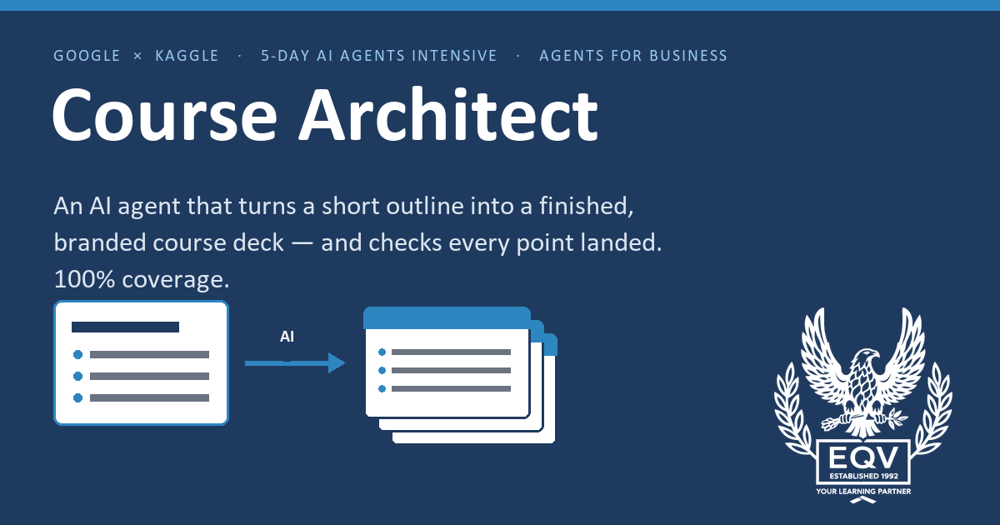

# Course Architect

**An AI agent that turns a single sentence into a finished, branded PowerPoint training course.**

Capstone for the Google × Kaggle **5-Day AI Agents Intensive (Vibe Coding)** — *Agents for Business* track.



Give it a plain-English topic — *"how to make basic Excel formulas"* — and it designs the
curriculum (modules + teachable points), writes every slide, worked example and speaker
note with **Gemini**, assembles a themed `.pptx` through an MCP-style tool layer, then
**checks its own coverage and self-corrects** until every planned point landed on a slide.

## Quick start

```bash
cd capstone/course-architect
pip install python-pptx google-genai
python run_demo.py --topic "any course you want"     # a finished .pptx
```

- Runs **without an API key** (deterministic offline writer). Set `GOOGLE_API_KEY`
  (free at aistudio.google.com) for Gemini-written content.
- **Non-coders:** double-click `Describe a Course.bat`, type a topic, press Enter —
  see `HOW TO USE.txt`.

## The capstone entry

| What | Where |
|---|---|
| Full project report (writeup) | [`capstone/course-architect/WRITEUP.md`](capstone/course-architect/WRITEUP.md) |
| Self-contained Kaggle notebook | [`capstone/course-architect/capstone_notebook.ipynb`](capstone/course-architect/capstone_notebook.ipynb) |
| Agent source (provider / tools / memory / builder) | [`capstone/course-architect/agent/`](capstone/course-architect/agent/) |
| Deck contract, themes, assembler + coverage eval | [`capstone/course-architect/deck/`](capstone/course-architect/deck/) |
| Video script & submission docs | [`capstone/course-architect/`](capstone/course-architect/) |

`capstone/arena-strategist/` is an earlier, self-contained Freestyle prototype kept for reference.

*Themes and prompts are generic; no proprietary brand assets are included.*
